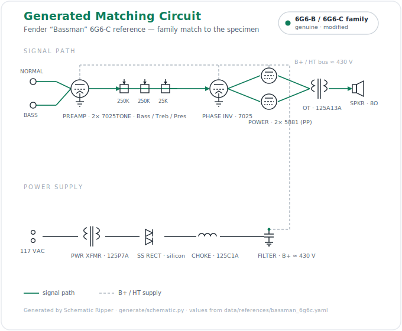

# Schematic Ripper

Reverse-engineer a vacuum-tube amplifier from photographs, establish its
**provenance** against a library of known circuits, and **generate a clean
matching schematic**.

First specimen: a point-to-point Fender Bassman of the **6G6-B / 6G6-C** family,
matched against the two factory documents in `sample_schematics/`.

## What it does (and deliberately doesn't)

Reconstructing full wiring from a handful of uncalibrated phone photos is not
solvable today — connectivity is hidden under cloth wire bundles and split across
frames. So v1 does **not** attempt automatic netlist extraction. Instead it
establishes provenance from what photos *do* support — **component complement,
values, transformer part numbers, and date codes** — via a weighted
**discriminator scorecard**. Topology confirmation (graph isomorphism) is a v2
add-on once a human has traced nets.

```
 ingest ──▶ vision extraction ──▶ human confirm ──▶ discriminator match ──▶ dossier
 (photos)   (Claude multimodal,    (editable BOM    (scorecard vs           (Markdown +
            Tesseract assist)       JSON)            reference signatures)    schematic)
```

## Sample outputs

**Generated matching circuit** — the identified circuit, synthesized and rendered from the 6G6-C reference signature:



**Provenance dossier** — the offline demo verdict; every row cites its source image (excerpt):

| | Feature | Expected | Observed |
|---|---|---|---|
| ✓ | tube:5881 | 5881 | 5881 |
| ✓ | tube:7025 | 7025 | 7025 |
| · | rectifier_type | solid_state | unknown |
| · | transformer:125P7A | 125P7A | — *(non-OE, excluded)* |

> **6G6-B · 37% · genuine (modified)** — runner-up 6G6-C. Family confirmed from period-correct construction; recap + non-OE transformers flag *modified*; 6G6-B vs 6G6-C left open (an honest under-call, not a guess).

More renders from `sripper generate`: [block diagram](docs/images/6G6-C_block.svg) · [detailed gain stage](docs/images/6G6-C_gainstage.svg).

## Quickstart

```bash
uv run sripper ingest                                   # list input assets
uv run sripper references                               # list reference signatures
uv run sripper analyze --bom tests/fixtures/sample_bom.json   # match offline (no API)
uv run sripper extract                                  # live vision pass (needs ANTHROPIC_API_KEY)
uv run sripper generate 6G6-C --out runs/               # render the matched circuit (needs `eda` extra)
uv run sripper decode --bands "yellow violet orange gold"     # colour bands -> 47kΩ ±5%
uv run sripper decode ".1mfd 400vdc"                          # vintage marking -> 100nF @ 400VDC
```

Install extras as needed: `uv pip install -e '.[vision,eda,graph]'`.

## Layout

| Path | Role |
|---|---|
| `src/schematic_ripper/models.py` | the shared pydantic data spine — import everywhere |
| `src/schematic_ripper/vision/` | Claude multimodal extraction + Tesseract assist |
| `src/schematic_ripper/values.py` | deterministic value parsing — cap/resistor codes, colour bands, SI normalization |
| `src/schematic_ripper/reference/` | YAML ground-truth fixtures + date-code decoding |
| `src/schematic_ripper/matching/` | discriminator scorecard (v1) + VF2 confirm (v2) |
| `src/schematic_ripper/generate/` | schemdraw schematic / layout / SPICE (v3) |
| `src/schematic_ripper/report/` | provenance dossier |
| `data/references/` | `bassman_6g6b.yaml`, `bassman_6g6c.yaml`, `date_codes.yaml` |
| `docs/` | `ARCHITECTURE.md`, `MODELS.md`, `PROVENANCE.md` (first-pass verdict) |
| `source_images/`, `sample_schematics/` | inputs (gitignored — drop your own here) |

See `docs/ARCHITECTURE.md` for the design rationale and `docs/PROVENANCE.md` for
the first-pass read on the specimen amp.
